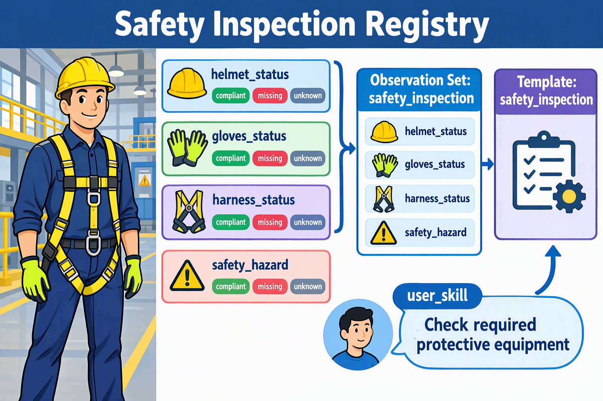
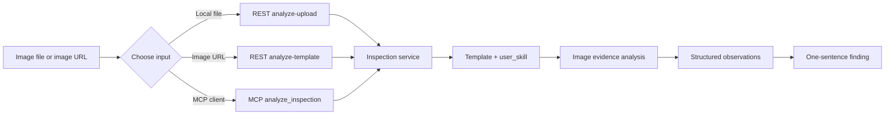

# Open Inspection Registry

[中文说明 / Chinese README](README_cn.md)

## English

Open Inspection Registry is a public catalog of reusable image-inspection templates,
observations, and skills. It helps users send images and an inspection intent to an Open
Inspection API or MCP server and receive structured, evidence-based results.

The service accepts one to three images. You can send image URLs or Base64 image content. Each
request should provide a `user_skill` describing what to inspect.

### Registry object model

- An **Observation** is one visual fact to check, such as `cleanliness` or `label_status`.
- An **Observation Set** is the registry-level group of observations for a use case. It defines
  which structured fields can be returned together. Normal users select a Template instead of an
  Observation Set.
- A **Template** is the user-facing, ready-to-use inspection choice. You can think of it as an
  Observation Set packaged with a repeatable workflow. Internally, each ready template maps to a
  versioned analyzer configuration; users do not need to know or manage that internal ID.
- A **Skill** describes the user's inspection goal. For normal use, provide that goal as
  `user_skill`.

For example, `helmet_status` is an **Observation**: it checks the visible helmet status in an
image and may return values such as `compliant`, `missing`, or `unknown`. A safety-focused
**Observation Set** can group `helmet_status`, `gloves_status`, `harness_status`, and
`safety_hazard`, so the API returns those structured fields together. A **Template** such as
`safety_inspection` is the user-facing package that makes this set and its workflow ready to use.
The `user_skill` is your request for this call, for example: “Check whether the required
protective equipment is visible.”



If the existing observations do not cover your use case, first submit an Issue using
[SKILL.md](SKILL.md). The owner reviews the proposal; after approval, the maintainer can add the
new observation to an existing template. You do not need to publish a template yourself.

### First call in three steps

1. Use the service root URL: `https://mcp.azure-api.net/inspection`.
2. Choose an endpoint: use `analyze-upload` for a local file or `analyze-template` for an image
   URL. In both cases, provide a ready `template_slug`.
3. Send a `user_skill` describing what to inspect, then read `inspection_result` and
   `image_results`.



### Current templates

- `general_inspection`: General image inspection. Use it when the inspection type is unknown
  or when you need a broad visual review.
  - `image_summary`: visible scene and main objects
  - `visible_safety_issue`: visible hazard or missing protection
  - `visible_quality_issue`: visible damage, dirt, defect, or workmanship issue
  - `text_or_label`: readable text, labels, or signs
  - `overall_condition`: `acceptable`, `needs_attention`, or `unknown`
- `5s_inspection`: 5S workplace inspection for visible sort, set-in-order, shine, and visual
  management cues. It does not infer sustained behavior or an unseen site standard from one image.
  - `unnecessary_items_status`: `none_visible`, `present`, or `unknown`
  - `work_area_organization`: `orderly`, `disorganized`, or `unknown`
  - `cleanliness`: `clean`, `dirty`, or `unknown`
  - `visual_management_status`: `clear`, `unclear`, `not_applicable`, or `unknown`
  - `five_s_summary`: short 5S finding
- `safety_inspection`: Workplace safety inspection, especially visible PPE and hazards.
  - `helmet_status`: `compliant`, `missing`, `worn_incorrectly`, `not_applicable`, or `unknown`
  - `gloves_status`: `compliant`, `missing`, `worn_incorrectly`, `not_applicable`, or `unknown`
  - `harness_status`: `compliant`, `missing`, `disconnected`, `not_applicable`, or `unknown`
  - `safety_hazard`: visible safety hazard description
  - `safety_summary`: short safety finding
- `quality_inspection`: Product, surface, and workmanship quality inspection.
  - `surface_damage`: `none`, `minor`, `major`, or `unknown`
  - `cleanliness`: `clean`, `dirty`, or `unknown`
  - `label_status`: `present`, `missing`, `damaged`, or `unknown`
  - `workmanship_issue`: visible assembly or workmanship issue
  - `quality_summary`: short quality finding

Pass a template as `template_slug`. If it is omitted or unavailable, the service uses the
general inspection template.

### REST API

The examples use the service root URL `https://mcp.azure-api.net/inspection`. Never add API keys,
SAS URLs, private image URLs, or production credentials to this repository.

### Image privacy and retention

The inspection agent engine backend service deletes uploaded images after processing completes.
The generated inspection result may be retained for up to 24 hours for retrieval and is then
automatically deleted. The 24-hour period applies to the result, not the uploaded image.

This service also does not persist uploaded files in its own local disk or database. Do not upload
images unless you have the right to process them and have considered applicable privacy
requirements.

Analyze one to three image URLs with a ready template:

```bash
curl -X POST 'https://mcp.azure-api.net/inspection/v1/inspections:analyze-template' \
  -H 'Content-Type: application/json' \
  -d '{
    "image_urls": ["<IMAGE_URL_1>", "<IMAGE_URL_2>"],
    "template_slug": "quality_inspection",
    "user_skill": "Check visible labels, cleanliness, and surface damage."
  }'
```

Single-image input is also supported:

```json
{
  "image_url": "<IMAGE_URL_1>",
  "template_slug": "general_inspection",
  "user_skill": "Check whether the warehouse label is present and readable."
}
```

To select a ready template, use `/v1/inspections:analyze-template`:

```json
{
  "image_urls": ["<IMAGE_URL_1>"],
  "template_slug": "quality_inspection",
  "user_skill": "Check visible labels, cleanliness, and surface damage."
}
```

For local image files, use `/v1/inspections:analyze-upload` with one to three `files` fields, a
ready `template_slug`, and a `user_skill`.

For a first request, use a `user_skill` to describe the inspection goal.

Public REST endpoints:

| Method | Path | Purpose |
| --- | --- | --- |
| `GET` | `/healthz` | Service health check |
| `GET` | `/v1/templates` | List ready templates |
| `GET` | `/v1/templates/{slug}` | Read one template |
| `POST` | `/v1/inspections:analyze-template` | Analyze image URLs with a template |
| `POST` | `/v1/inspections:analyze-upload` | Analyze uploaded image files with a template |

### Example: 5S inspection

Suppose you have a local image:

```text
./images/work-area.jpg
```

For a local image file, use the upload endpoint:

```bash
curl -X POST 'https://mcp.azure-api.net/inspection/v1/inspections:analyze-upload' \
  -F 'files=@./images/work-area.jpg' \
  -F 'template_slug=5s_inspection' \
  -F 'user_skill=Inspect the visible 5S conditions: sort, set in order, shine, standardize, and sustain.'
```

The response contains per-image observations and one final finding:

```json
{
  "inspection_result": {
    "finding": "The work area shows visible disorder and insufficient cleanliness."
  },
  "image_results": [
    {
      "index": 1,
      "observations": {
        "unnecessary_items_status": "present",
        "work_area_organization": "disorganized",
        "cleanliness": "dirty",
        "visual_management_status": "unknown",
        "five_s_summary": "The work area shows visible disorder and insufficient cleanliness."
      }
    }
  ]
}
```

`5s_inspection` returns fixed 5S fields. It reports only cues visible in the image; use `unknown`
rather than guessing about sustained behavior or a site standard that was not supplied.

If the image already has an accessible URL, use the template endpoint:

```bash
curl -X POST 'https://mcp.azure-api.net/inspection/v1/inspections:analyze-template' \
  -H 'Content-Type: application/json' \
  -d '{
    "image_urls": ["<IMAGE_URL_1>"],
    "template_slug": "5s_inspection",
    "user_skill": "Inspect the visible 5S workplace-management issues."
  }'
```

Use this quick guide:

- Local image file: `/v1/inspections:analyze-upload`
- Image URL with a template: `/v1/inspections:analyze-template`
- MCP client: call `analyze_inspection`

### MCP

The Streamable HTTP MCP endpoint is:

```text
https://mcp.azure-api.net/inspection/mcp/
```

The MCP tool is `analyze_inspection`:

```json
{
  "image_urls": ["<IMAGE_URL_1>"],
  "template_slug": "safety_inspection",
  "user_skill": "Check whether required protective equipment is visible."
}
```

Use `images_base64` instead of `image_urls` when sending image bytes. Provide exactly one of
these two input forms. MCP supports `template_slug` and `user_skill`.

### Response example

```json
{
  "inspection_result": {
    "finding": "The image shows a visible label and no major surface damage."
  },
  "image_results": [
    {
      "index": 1,
      "source": "<IMAGE_SOURCE>",
      "observations": {
        "label_status": "present",
        "surface_damage": "none"
      }
    }
  ],
  "observations": {
    "label_status": "present",
    "surface_damage": "none"
  }
}
```

Results are grounded in visible image evidence. An observation may be `unknown` when the
image does not provide enough evidence.

### Contributing

To propose a new inspection field or checkpoint, read [SKILL.md](SKILL.md). Do not submit
customer images, confidential documents, private service URLs, API keys, SAS URLs, or secrets.
An Issue should include at least one positive and one negative example image, or a link to a
public example. These images explain the proposed field or template; they are not customer
inspection inputs. Use public, synthetic, or fully anonymized examples with no confidential
content. Maintainers may request or add more examples before merging the field.
