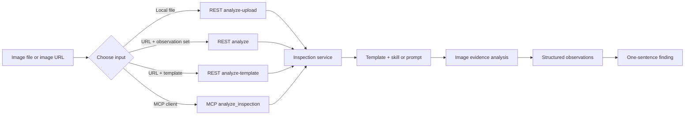

# Open Inspection Registry

[中文说明 / Chinese README](README_cn.md)

## English

Open Inspection Registry is a public catalog of reusable image-inspection templates,
observations, and skills. It helps users send images and an inspection intent to an Open
Inspection API or MCP server and receive structured, evidence-based results.

The service accepts one to three images. You can send image URLs or Base64 image content. Your
inspection intent can be a registered `skill`, a free-form `user_skill`, or a `prompt`.

### First call in three steps

1. Obtain `<YOUR_API_BASE_URL>` from the service provider. For an API Management deployment,
   this value includes the gateway host and the configured API suffix, for example
   `<YOUR_API_GATEWAY_URL>/<YOUR_API_SUFFIX>`. Replace the whole placeholder once; do not append
   the suffix a second time. This repository intentionally does not publish a real service URL
   or API key.
2. Choose an endpoint: use `analyze-upload` for a local file, `analyze` for image URLs with an
   observation set, or `analyze-template` for image URLs with a template.
3. Send a `user_skill` or `prompt` describing what to inspect, then read `inspection_result` and
   `image_results`. Use a registered `skill` only when you have its exact name.



### Current templates

- `general_inspection`: General image inspection. Use it when the inspection type is unknown
  or when you need a broad visual review.
  - `image_summary`: visible scene and main objects
  - `visible_safety_issue`: visible hazard or missing protection
  - `visible_quality_issue`: visible damage, dirt, defect, or workmanship issue
  - `text_or_label`: readable text, labels, or signs
  - `overall_condition`: `acceptable`, `needs_attention`, or `unknown`
- `safety_inspection`: Workplace safety inspection, especially visible PPE and hazards.
  - `helmet_status`: `compliant`, `missing`, `worn_incorrectly`, `not_applicable`, or `unknown`
  - `gloves_status`: `compliant`, `missing`, `worn_incorrectly`, `not_applicable`, or `unknown`
  - `harness_status`: `compliant`, `missing`, `disconnected`, `not_applicable`, or `unknown`
  - `safety_hazard`: visible safety hazard description
  - `safety_summary`: short safety finding
- `quality_inspection`: Product, surface, and workmanship quality inspection.
  - `surface_damage`: `none`, `minor`, `major`, or `unknown`
  - `cleanliness`: `clean`, `dirty`, or `unknown`
  - `label_status`: `present`, `missing`, `damaged`, or `unknown`
  - `workmanship_issue`: visible assembly or workmanship issue
  - `quality_summary`: short quality finding

Pass a template as `template_slug`. If it is omitted or unavailable, the service uses the
general inspection template.

### REST API

Replace `<YOUR_API_BASE_URL>` with the complete service URL for your deployment. For APIM, include
the configured API suffix in this value and do not append it again. Never add
API keys, SAS URLs, private image URLs, or production credentials to this repository.

Analyze one to three images by URL with an observation set:

```bash
curl -X POST '<YOUR_API_BASE_URL>/v1/inspections:analyze' \
  -H 'Content-Type: application/json' \
  -d '{
    "image_urls": ["<IMAGE_URL_1>", "<IMAGE_URL_2>"],
    "observation_set": "manufacturing_quality_basic",
    "prompt": "Check visible labels, cleanliness, and surface damage."
  }'
```

Single-image input is also supported:

```json
{
  "image_url": "<IMAGE_URL_1>",
  "user_skill": "Check whether the warehouse label is present and readable."
}
```

To select a ready template, use `/v1/inspections:analyze-template`:

```json
{
  "image_urls": ["<IMAGE_URL_1>"],
  "template_slug": "quality_inspection",
  "prompt": "Check visible labels, cleanliness, and surface damage."
}
```

For local image files, use `/v1/inspections:analyze-upload` with one to three `files` fields
and an `observation_set`. The request must include one of `skill`, `user_skill`, or `prompt`.

For a first request, use `user_skill` or `prompt`. Use a registered `skill` only when you know
its exact name; skill names are not assumed to be discoverable from this public registry.

Public REST endpoints:

| Method | Path | Purpose |
| --- | --- | --- |
| `GET` | `/healthz` | Service health check |
| `GET` | `/v1/registry/observation-sets` | List built-in observation sets |
| `GET` | `/v1/templates` | List ready templates |
| `GET` | `/v1/templates/{slug}` | Read one template |
| `POST` | `/v1/inspections:analyze` | Analyze image URLs with an observation set |
| `POST` | `/v1/inspections:analyze-template` | Analyze image URLs with a template |
| `POST` | `/v1/inspections:analyze-upload` | Analyze uploaded image files |

### Example: 5S inspection

Suppose you have a local image:

```text
./images/work-area.jpg
```

Obtain the API base URL for your deployment and replace `<YOUR_API_BASE_URL>` below.
This public repository intentionally does not provide a real service URL or API key.

For a local image file, use the upload endpoint:

```bash
curl -X POST '<YOUR_API_BASE_URL>/v1/inspections:analyze-upload' \
  -F 'files=@./images/work-area.jpg' \
  -F 'observation_set=manufacturing_quality_basic' \
  -F 'user_skill=Inspect the visible 5S conditions: sort, set in order, shine, standardize, and sustain.'
```

The response contains per-image observations and one final finding:

```json
{
  "inspection_result": {
    "finding": "The work area shows visible disorder and insufficient cleanliness."
  },
  "image_results": [
    {
      "index": 1,
      "observations": {
        "cleanliness": "dirty",
        "surface_damage": "unknown"
      }
    }
  ]
}
```

There is currently no dedicated `5s_inspection` template. This approach can provide a 5S
feedback sentence using a free-form skill, while structured fields depend on the selected
observation set. To request fixed 5S fields, follow [SKILL.md](SKILL.md) and submit an Issue
using its field/checkpoint format.

If the image already has an accessible URL, use the template endpoint:

```bash
curl -X POST '<YOUR_API_BASE_URL>/v1/inspections:analyze-template' \
  -H 'Content-Type: application/json' \
  -d '{
    "image_urls": ["<IMAGE_URL_1>"],
    "template_slug": "general_inspection",
    "user_skill": "Inspect the visible 5S workplace-management issues."
  }'
```

Use this quick guide:

- Local image file: `/v1/inspections:analyze-upload`
- Image URL with a template: `/v1/inspections:analyze-template`
- Image URL with an observation set: `/v1/inspections:analyze`
- MCP client: call `analyze_inspection`

### MCP

The Streamable HTTP MCP endpoint is:

```text
<YOUR_API_BASE_URL>/mcp/
```

The MCP tool is `analyze_inspection`:

```json
{
  "image_urls": ["<IMAGE_URL_1>"],
  "template_slug": "safety_inspection",
  "user_skill": "Check whether required protective equipment is visible."
}
```

Use `images_base64` instead of `image_urls` when sending image bytes. Provide exactly one of
these two input forms. MCP supports `template_slug`, `skill`, `user_skill`, and `prompt`.

### Response example

```json
{
  "inspection_result": {
    "finding": "The image shows a visible label and no major surface damage."
  },
  "image_results": [
    {
      "index": 1,
      "source": "<IMAGE_SOURCE>",
      "observations": {
        "label_status": "present",
        "surface_damage": "none"
      }
    }
  ],
  "observations": {
    "label_status": "present",
    "surface_damage": "none"
  }
}
```

Results are grounded in visible image evidence. An observation may be `unknown` when the
image does not provide enough evidence.

### Contributing

To propose a new inspection field or checkpoint, read [SKILL.md](SKILL.md). Do not submit
customer images, confidential documents, real service URLs, API keys, SAS URLs, or secrets.
