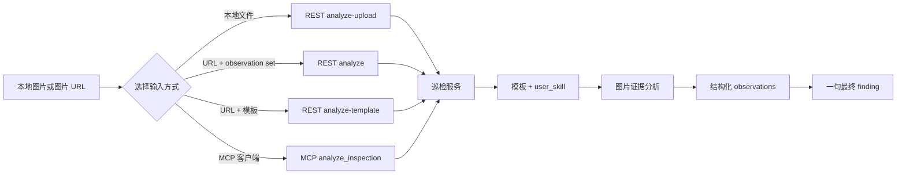

# Open Inspection Registry 中文说明

Open Inspection Registry 是一个公开的图像巡检模板、观察项和 Skill 目录。它帮助用户向
Open Inspection API 或 MCP 服务发送图片和巡检意图，并获得基于图片证据的结构化结果。

## Registry 对象模型

- **Observation**：一个要从图片中检查的视觉事实，例如 `cleanliness` 或 `label_status`。
- **Observation Set**：registry 中面向某个场景的一组 observations，决定可以一起返回哪些
  结构化字段。
- **Template**：用户可以直接选择的完整巡检方案。普通用户可以把它理解为“Observation Set
  加上可重复使用的巡检流程”；在内部，每个 ready template 都会对应一个版本化的 analyzer
  配置，用户不需要知道或管理这个内部 ID。
- **Skill**：用户想完成的巡检目标。普通用户通过 `user_skill` 提供这个目标。

例如，`helmet_status` 是一个 **Observation**，用于检查图片中可见的安全帽状态，可能返回
`compliant`、`missing` 或 `unknown`。面向安全巡检的 **Observation Set** 可以把
`helmet_status`、`gloves_status`、`harness_status` 和 `safety_hazard` 组合在一起，让 API
一次返回这些结构化字段。`safety_inspection` 这样的 **Template** 是把这组字段和巡检流程
打包成可以直接使用的用户方案。`user_skill` 则是本次请求想检查的目标，例如“检查图片中
是否能看到必要的个人防护装备”。


如果现有 observation 无法覆盖你的场景，请先按照 [SKILL.md](SKILL.md) 提交 GitHub Issue。
由 owner 审核需求；审核通过后，维护者可以把新 observation 加入现有 template。普通用户
不需要自行发布 template。

## 当前模板

- `general_inspection`：通用图像巡检。适合不知道检查类型，或需要进行全面图像检查的场景。
  - `image_summary`：图片场景和主要物体概述
  - `visible_safety_issue`：可见安全隐患或防护缺失
  - `visible_quality_issue`：可见损坏、污渍、缺陷或施工问题
  - `text_or_label`：图片中可读的文字、标签或标牌
  - `overall_condition`：`acceptable`、`needs_attention` 或 `unknown`
- `safety_inspection`：安全巡检，重点检查可见的个人防护装备和现场隐患。
  - `helmet_status`：`compliant`、`missing`、`worn_incorrectly`、`not_applicable` 或 `unknown`
  - `gloves_status`：`compliant`、`missing`、`worn_incorrectly`、`not_applicable` 或 `unknown`
  - `harness_status`：`compliant`、`missing`、`disconnected`、`not_applicable` 或 `unknown`
  - `safety_hazard`：可见安全隐患描述
  - `safety_summary`：简短的安全检查结论
- `quality_inspection`：质量巡检，适合产品、表面和施工工艺检查。
  - `surface_damage`：`none`、`minor`、`major` 或 `unknown`
  - `cleanliness`：`clean`、`dirty` 或 `unknown`
  - `label_status`：`present`、`missing`、`damaged` 或 `unknown`
  - `workmanship_issue`：可见装配或施工工艺问题
  - `quality_summary`：简短的质量检查结论

通过 `template_slug` 指定模板。如果不填写，或者模板不可用，服务会使用通用巡检模板。

## REST API

示例使用服务根地址 `https://mcp.azure-api.net/inspection`。不要在公开仓库中加入 API key、
SAS URL、私人图片 URL 或生产环境凭据。

## 图片安全与保留

Inspection Agent Engine 后端服务会在图片处理完成后删除上传的图片。生成的巡检结果最多保留
24 小时供读取，之后自动删除。24 小时适用于结果，不适用于上传的图片。

本服务自身也不会把上传文件持久化到本地磁盘或数据库。请确认你有权处理图片，并根据适用
的隐私要求决定是否上传。

服务一次接受一到三张图片。图片可以通过 URL 或 Base64 内容发送。巡检意图可以使用已经
巡检意图使用 `user_skill` 字段提供巡检目标。

## 第一次调用：只需要三步

1. 使用服务根地址 `https://mcp.azure-api.net/inspection`。
2. 选择接口：本地文件使用 `analyze-upload`，图片 URL 加 observation set 使用 `analyze`，
   图片 URL 加模板使用 `analyze-template`。
3. 使用 `user_skill` 描述要检查什么，然后读取返回结果中的 `inspection_result` 和
   `image_results`。



通过图片 URL 和 observation set 分析一到三张图片：

```bash
curl -X POST 'https://mcp.azure-api.net/inspection/v1/inspections:analyze' \
  -H 'Content-Type: application/json' \
  -d '{
    "image_urls": ["<IMAGE_URL_1>", "<IMAGE_URL_2>"],
    "observation_set": "manufacturing_quality_basic",
    "user_skill": "检查可见的标签、清洁度和表面损坏。"
  }'
```

也支持单图片输入：

```json
{
  "image_url": "<IMAGE_URL_1>",
  "user_skill": "检查仓库物料标签是否存在并且清晰可读。"
}
```

如果要选择已经准备好的模板，请使用 `/v1/inspections:analyze-template`：

```json
{
  "image_urls": ["<IMAGE_URL_1>"],
  "template_slug": "quality_inspection",
  "user_skill": "检查可见的标签、清洁度和表面损坏。"
}
```

本地图片文件可以使用 `/v1/inspections:analyze-upload`，提交一到三个 `files` 字段和
`observation_set`。请求必须提供 `user_skill`。

第一次调用请使用 `user_skill` 描述巡检目标。

公开 REST API 包括：

| 方法 | 路径 | 用途 |
| --- | --- | --- |
| `GET` | `/healthz` | 健康检查 |
| `GET` | `/v1/registry/observation-sets` | 读取内置 observation set |
| `GET` | `/v1/templates` | 读取可用模板列表 |
| `GET` | `/v1/templates/{slug}` | 读取单个模板 |
| `POST` | `/v1/inspections:analyze` | 使用 observation set 分析图片 URL |
| `POST` | `/v1/inspections:analyze-template` | 使用模板分析图片 URL |
| `POST` | `/v1/inspections:analyze-upload` | 分析上传的图片文件 |

## 示例：5S 现场巡检

假设你有一张本地图片：

```text
./images/work-area.jpg
```

使用上传接口发送图片。这个接口适合本地图片文件：

```bash
curl -X POST 'https://mcp.azure-api.net/inspection/v1/inspections:analyze-upload' \
  -F 'files=@./images/work-area.jpg' \
  -F 'observation_set=manufacturing_quality_basic' \
  -F 'user_skill=检查现场5S：整理、整顿、清扫、清洁和素养，指出图片中可见的问题。'
```

服务会返回每张图片的 observations 和一句最终 finding。例如：

```json
{
  "inspection_result": {
    "finding": "图片显示工作区域存在物品摆放不整齐和清洁不足的问题。"
  },
  "image_results": [
    {
      "index": 1,
      "observations": {
        "cleanliness": "dirty",
        "surface_damage": "unknown"
      }
    }
  ]
}
```

当前模板列表中还没有专门的 `5s_inspection` 模板。上面的方式可以先使用自由文本获得
5S 反馈，但返回的结构化字段取决于所选 `observation_set`。如果需要固定的 5S 字段，
请按照 [SKILL.md](SKILL.md) 提交新的 field/checkpoint Issue，由维护者创建或发布对应模板。

如果图片已经有可访问的 URL，可以使用模板接口：

```bash
curl -X POST 'https://mcp.azure-api.net/inspection/v1/inspections:analyze-template' \
  -H 'Content-Type: application/json' \
  -d '{
    "image_urls": ["<IMAGE_URL_1>"],
    "template_slug": "general_inspection",
    "user_skill": "检查图片中的5S现场管理问题。"
  }'
```

简单选择：

- 本地图片文件：使用 `/v1/inspections:analyze-upload`
- 图片 URL + 模板：使用 `/v1/inspections:analyze-template`
- 图片 URL + observation set：使用 `/v1/inspections:analyze`
- MCP 客户端：调用 `analyze_inspection`

## MCP

Streamable HTTP MCP 地址为：

```text
https://mcp.azure-api.net/inspection/mcp/
```

MCP tool 名称为 `analyze_inspection`：

```json
{
  "image_urls": ["<IMAGE_URL_1>"],
  "template_slug": "safety_inspection",
  "user_skill": "检查图片中是否能看到必要的个人防护装备。"
}
```

如果直接发送图片内容，可以使用 `images_base64` 代替 `image_urls`。两者必须二选一。
MCP 支持 `template_slug` 和 `user_skill`。

## 输出示例

返回结果包括每张图片的 observations，以及一句简洁的最终 finding：

```json
{
  "inspection_result": {
    "finding": "图片显示标签清晰可见，未发现明显的表面损坏。"
  },
  "image_results": [
    {
      "index": 1,
      "source": "<IMAGE_SOURCE>",
      "observations": {
        "label_status": "present",
        "surface_damage": "none"
      }
    }
  ]
}
```

所有结果都应基于图片中可见的证据。如果图片无法提供足够证据，观察项可以返回
`unknown`，而不是猜测。

## 提交新的检查点或字段

如果要提交新的 inspection field 或 checkpoint，请按照 [SKILL.md](SKILL.md) 的格式填写
GitHub Issue。Issue 至少应说明：

1. 要解决的巡检问题。
2. 现有字段或模板为什么不够用。
3. 新字段的 `id`、`type` 和允许值。
4. 至少提供一张正面和一张反面示例图片，或公开示例链接。这些图片用于解释新字段或模板，
   不是客户巡检输入。请使用公开、合成或已完全匿名化且不含机密内容的示例图片，欢迎提供
   更多示例。
5. 一个 REST 或 MCP 请求示例。
6. 一个预期响应示例。

不要提交客户图片、私人图片、机密文件、私人服务地址、API key、SAS URL 或其他秘密信息。

[English README](README.md)
